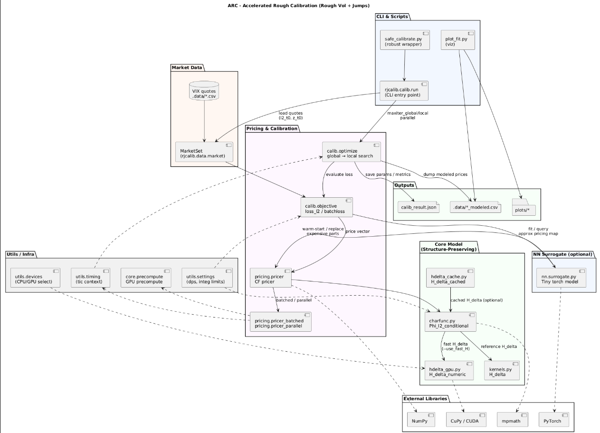

# ARC – Accelerated Rough Calibration
## Author: Saidou Diallo
## LinkedIn: https://www.linkedin.com/in/saidoudialloquant/
### PROGRAMS USED
TABLEAU • GIT BASH • VS CODE • PLANTUML • PYTHON VENV • GITHUB • JUPYTER • CUDA TOOLKIT
### LANGUAGES USED
PYTHON • BASH
### SKILLS USED
TIME-SERIES MODELING • STOCHASTIC CALCULUS • NUMERICAL OPTIMIZATION • SYSTEM DESIGN • PARALLEL COMPUTING • GPU ACCELERATION • DATA ENGINEERING • SCIENTIFIC PYTHON DEVELOPMENT • SOFTWARE ARCHITECTURE
## SUMMARY
ARC (Accelerated Rough Calibration) is a complete research-grade framework for calibrating rough volatility models with jumps using characteristic-function–based pricing, fast numerical convolution kernels, and optional GPU acceleration. I named it ARC because the entire system is designed to be an “accelerated arc” between raw VIX-style market data and usable model parameters—bridging the gap between theory and production-ready quantitative tooling.
This project is built for quantitative researchers, volatility traders, and academics working with rough-volatility dynamics or forward-variance derivatives (e.g., VIX options, power options, realized-variance swaps). ARC solves the problem of slow or unstable rough-volatility calibration, providing structure-preserving transforms, deterministic kernels, and tunable fast-paths instead of brute-force simulations.
ARC is more robust and more configurable than simply “using XYZ library” because it (1) exposes the underlying math transparently, (2) implements both reference and accelerated pricing paths, (3) includes a fallback system for zero-failure calibration workflows, and (4) is fully modular—your own kernels, models, or NN surrogates can be swapped in without rewriting the pipeline.
## VALUE PROPOSITION
ARC provides a transparent, fast, and research-ready calibration pipeline for rough-volatility models with jumps. It enables repeatable, production-grade calibrations that are understandable, auditable, and extensible.
## ARCHITECTURE DIAGRAM

## QUICKSTART (GIT BASH)
### STEP 1 — Clone & Set Up Environment
git clone https://github.com/SaidouDialloNCState/arc.git
cd arc
python -m venv .venv
source .venv/Scripts/activate
pip install -e .
### STEP 2 — Run the Safe Calibrator
python scripts/safe_calibrate.py \
  --csv .data/sample_vix.csv \
  --out_json calib_result.json \
  --out_csv .data/sample_vix_modeled.csv \
  --g 5 --l 5 --par 4
### STEP 3 — Plot the Fit
python scripts/plot_fit.py \
  --input .data/sample_vix_modeled.csv \
  --out plots/fit.png
# Modeling & Methods
ARC implements a structure-preserving conditional characteristic function for rough volatility with tempered-stable jumps, enabling analytical pricing of VIX/power-type derivatives without full path simulation. The framework uses multiple variants of the rough kernel 𝐻Δ: a reference closed-form kernel, a numerical CPU version, and an optional GPU-accelerated kernel. The calibration objective uses both scalar and batched loss functions, supporting global-then-local optimization and parallel evaluation. All transforms support high-precision arithmetic via mpmath with configurable integration bounds.
# Engineering & Performance
The system includes robust fallback calibration, ensuring that output is always produced, even if fast kernels or transforms fail. GPU acceleration (via CuPy) and parallel batched pricing help scale calibration sweeps across large parameter grids. All components are structured into modular packages with unit tests, smoke tests, CLI tests, and timing utilities. The codebase is fully version-controlled, with separate safe scripts for reproducible research and deployment.
# Features
ARC provides: CLI calibration, GPU/CPU selection, high-precision CF transforms, parallel pricers, plotting/reporting scripts, and a tiny PyTorch surrogate model for warm-starting calibrations. Users can toggle fast kernels (--use_fast_H) or rely on exact kernels for verification. The architecture cleanly separates market data, models, pricing engines, calibration routines, and visualization/report layers. All outputs (prices, plots, model parameters, reports) are generated automatically for reproducible quant research.
